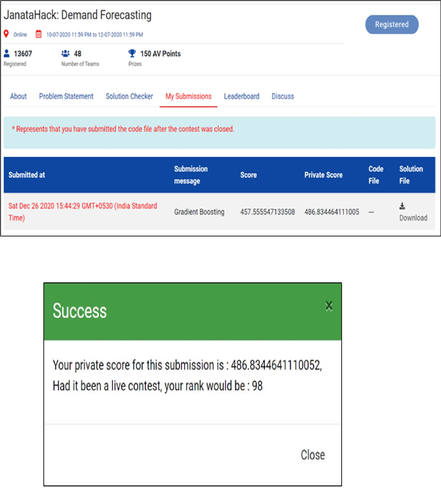

# Sales_Forecasting
## Objective
The main objective of this project is to predict the sale for a retail unit in the future, given the data of previous sales. The first part of this project involves generating a hypothesis about the given data and then exploring the dataset to extract features from raw data via data mining techniques.  

## Problem Statement
### Business Problem
Demand Forecasting is the process in which historical sales data is used to develop an estimate of an expected forecast of customer demand. It is the pivotal business process around which strategic and operational plans of a company are devised. One of the largest retail chains in the world wants to use their vast data source to build an efficient forecasting model to predict the sales for each product in its portfolio at its 76 different stores using historical sales data for the past 3 years on a week-on-week basis. Sales and promotional information is also available for each week - product and store wise. However, no other information regarding stores and products are available.  
### Translate Business Problem into Data Science/Machine Learning Problem
This is a regression problem in which we have to predict the number of units sold of each product. The dependent or the target variable is units_sold, while the rest are independent variables or features. We need to develop a model using the features to predict the target variable.  

## Data Collection
The data has already been provided by Analytics Vidhya on the [Hackathon Page](https://datahack.analyticsvidhya.com/contest/janatahack-demand-forecasting/). The training set will be used for training the model. The test set contains all the independent variables, but not the target variable. We will apply the model to predict the target variable for the test data.

## Dependencies:
[Numpy](https://numpy.org/) 
[IPython](https://ipython.org/) 
[ScikitLearn](https://scikit-learn.org/stable/) 
[Pandas](https://pandas.pydata.org/) 
[Seaborn](https://seaborn.pydata.org/) 

#### This notebook can be run interactively on Google Colab or on Jupyter

## Description
Demand Forecasting is the pivotal business process around which strategic and operational plans of a company are devised. Based on the Demand Forecast, strategic and long-range plans of a business, like budgeting, financial planning, sales and marketing plans, capacity planning, risk assessment and mitigation plans are formulated.
## Hypothesis Generation
Hypothesis Generation is the process of listing out all the possible factors that can affect the outcome i.e., which of the features will have an impact on whether a loan will be approved or not. Some of the hypothesis are:
- Month: The sales might depend on the month of the year they were sold in because of different occasions and festivals.
-	Store ID: Sales of some stores may be higher than that of others.
-	SKU ID (Product ID): Demand of some products will be higher than others.
-	Total price: Sale of units with lower total price will be higher.
-	Discount percentage: Sale of units with higher discount will be higher.
-	Featured: The sale of featured units will be higher.
-	Displayed: The sale of displayed units will be higher.
-	And so on…
Some of the hypotheses seem intuitive while others may not. We will try to validate each of these hypotheses based on the dataset. 

## Submission Result

